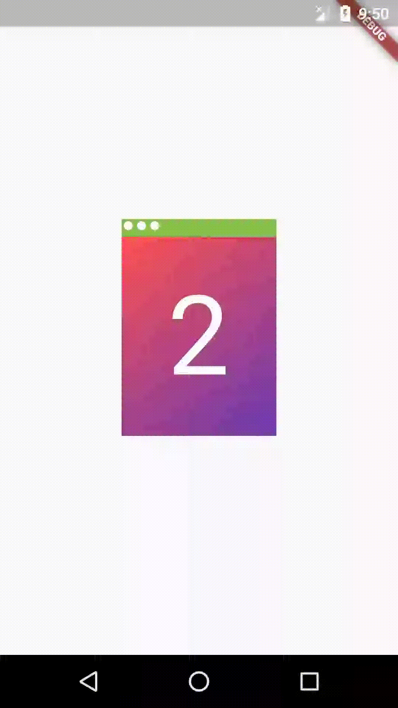
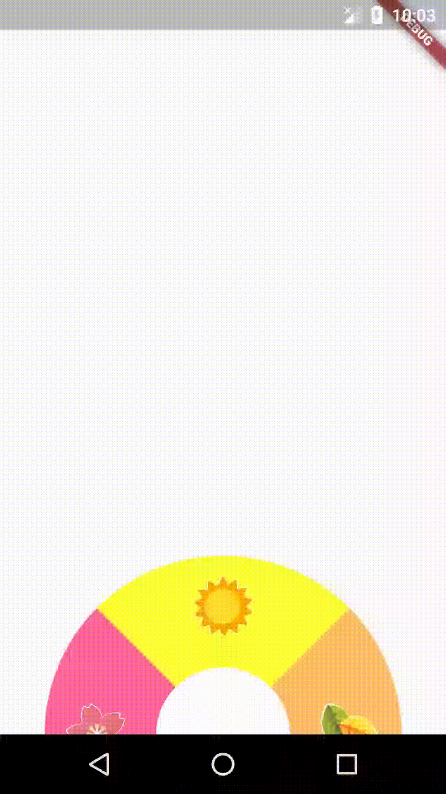
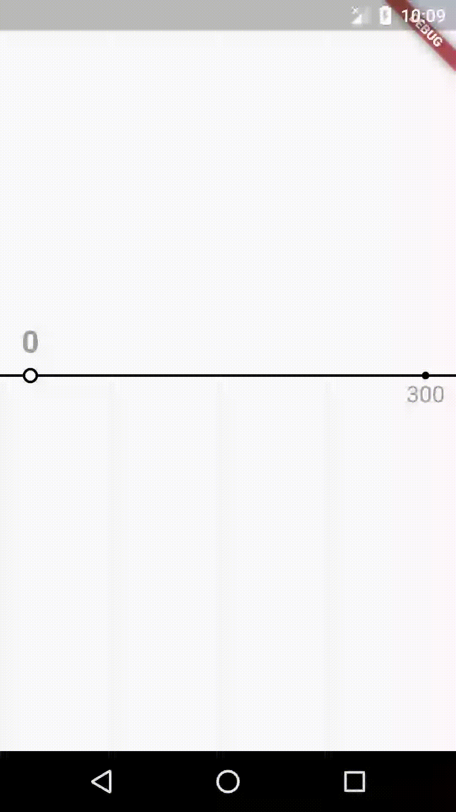
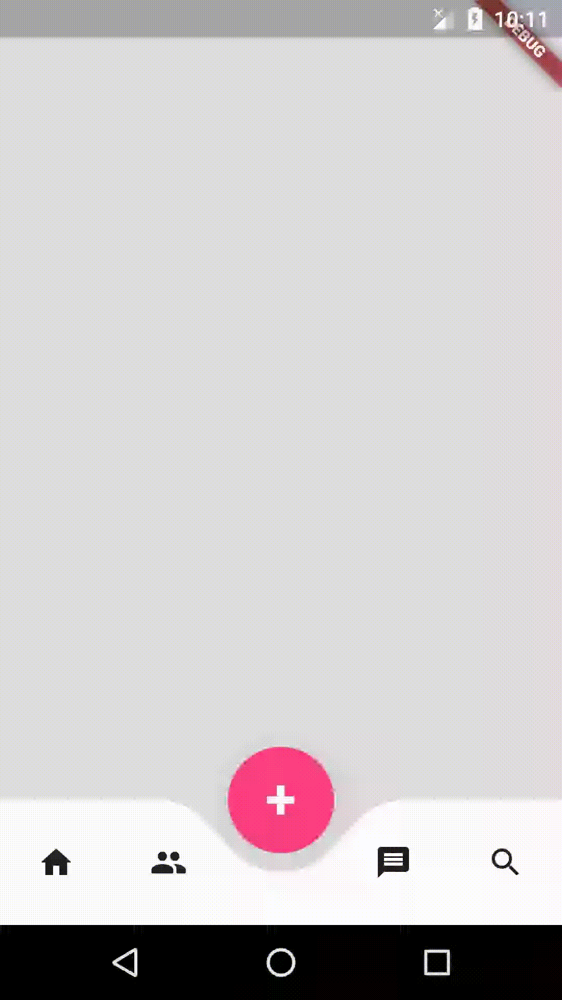

# bss_flutter_open

Beesight Soft Flutter open widgets

## Flip animation

## Four seasons

## Front back card

## List animation

## Quick switch

## Seat map

## Slider selector

## Store card

## Tab bar exploration

## Toss card exploration

## Turn page exploration

## Using card exploration

## Custom calendar

## Demo calendar
